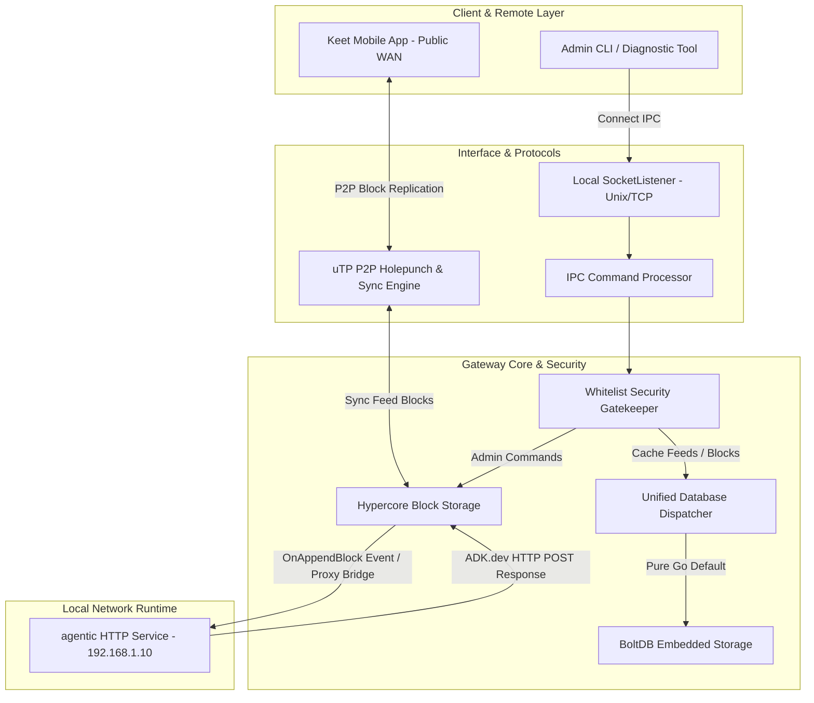
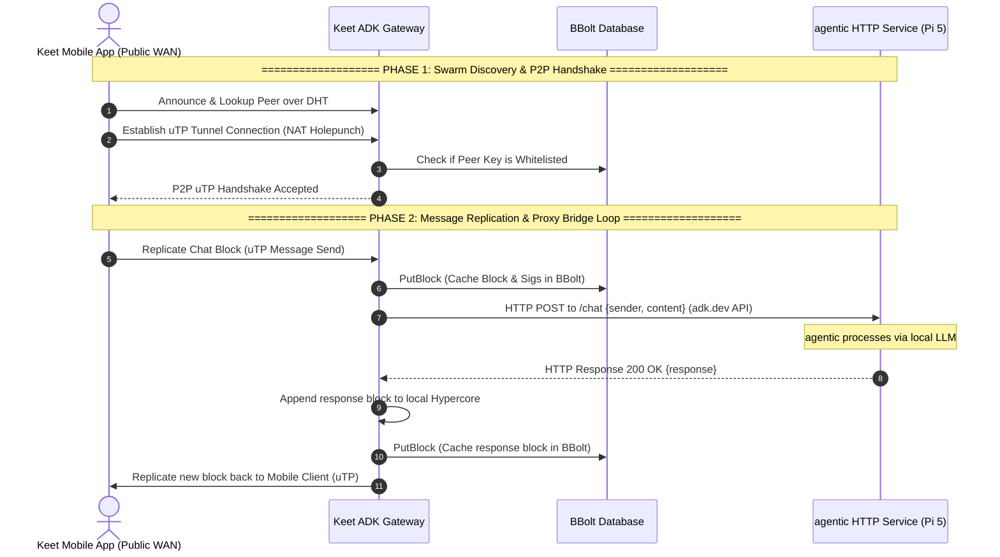

# System Architecture Guide

The Keet ADK Gateway serves as a localized, high-performance coordination conduit. It bridges external application nodes and mobile clients using the Keet Application Development Kit (ADK) into decentralized, DHT-backed overlay networks.

This document describes the core service topology, packet routing, and internal subsystem designs of the gateway.

---

## 1. System Topology Overview

The gateway is built on a multi-layered, asynchronous architecture structured into decoupled modules:

---

## 2. Subsystem Breakdowns

### A. Interface & IPC Handler (`pkg/ipc`)
* **Multi-Protocol Socket Listener (`SocketListener`):** Detects whether the configured socket address is a local file path (Unix Socket) or an network port/prefix (`tcp://` or `:port`). If a TCP port is requested, it binds to a network-facing TCP interface, enabling wireless connections from local networks (e.g., phones on local Wi-Fi).
* **Security Gatekeeper:** If a `client_whitelist` is present in the configuration, all connections are initially placed in a locked, unauthenticated state. The gatekeeper checks every incoming frame for a valid whitelisted `peer_key` (public key in hex) or an explicit `auth` handshake command. Unwhitelisted clients are instantly disconnected.

### B. Configuration System (`pkg/config`)
* Evaluates parameters dynamically across **four tiers of precedence**:
  1. Handcrafted Command-Line overrides (e.g. `--config /path/to/yaml` or `-config=`).
  2. Local directory `./config.yaml`.
  3. Binary directory location `/path/to/binary/config.yaml`.
  4. Environment-level default variables.

### C. Database Persistence Engine (`pkg/db`)
* Decoupled using an abstract repository pattern:
  * `SwarmRepository`: Manages swarm topic metadata, tracking currently active uTP channel handshakes.
  * `BlockRepository`: Stores and caches full, raw, authenticated Hypercore block structures.
* **BBolt Persistence (Embedded default):** Utilizes key-value bucket nesting inside memory-mapped files. The blocks are packaged alongside their secure signatures via an ultra-fast length-prefixed binary serialization mechanism.
* **PostgreSQL Backup Driver:** Structured for scale. Connects using connection pooling and automatically manages table definitions and index migrations on startup.

### D. Hypercore & DHT P2P Overlay (`pkg/hypercore`, `pkg/dht`, `pkg/network`)
* **DHT Node:** Operates a distributed Kademlia-based hash table. Orchestrates room announcements and peer lookups.
* **Hypercore Replication Engine:** Governs bitfield negotiation, block requests, and remote stream replication. Uses custom uTP holepunch protocols to pipe binary feeds asynchronously across local subnets and WANs.

---

## 3. Data Flow & Sequence Diagram

The diagram below outlines the standard flow when an authorized client registers a swarm topic, appends a block, and replicates it:

---

## 4. Concurrency & Thread-Safety Model

The Keet ADK Gateway is designed from the ground up for high-performance concurrent processing. This ensures it can handle multiple peer sync streams, local HTTP API proxy requests, and IPC client broadcast requests simultaneously without lock contention or data races.

### A. Thread-Safe Subsystems

| Subsystem | Components Involved | Synchronization Mechanism |
|---|---|---|
| **Local Hypercore Storage** | `hypercore.Storage` (`Len`, `Append`, `Get`) | Explicit `sync.Mutex` locks protect log offset, lengths, and file handles from concurrent write corruption. |
| **Active Clients Registry** | `ipc.ClientRegistry` (`Register`, `Unregister`, `Broadcast`) | Mutex locks ensure thread-safe registration and iteration of active local IPC socket streams. |
| **Database Persistence** | `db.SwarmRepository`, `db.BlockRepository` | **BBolt** uses an internal database mutex for ACID writes via transactions (`db.Update`). **PostgreSQL** uses connection pooling (`pgx` with `sql.DB`) for secure multi-threaded query multiplexing. |
| **Configurations** | `config.Config` | Loaded on startup and treated as read-only (immutable) throughout the lifecycle of the process. |

### B. Multi-Threaded Replication Execution Flow

When multiple external peers on the public Internet replicate blocks simultaneously over uTP:
1. **Goroutine-per-Connection:** The TCP/uTP network listener spawns a standalone, lightweight goroutine for each active peer session.
2. **Concurrent Callback Execution:** The replication callback (`pm.OnAppendBlock`) is invoked concurrently on the matching peer's goroutine, handling parallel block updates.
3. **Asynchronous HTTP Proxy (Non-blocking I/O):** Inside `OnAppendBlock`, forwarding HTTP messages to the local `agentic` service is offloaded to a newly spawned goroutine (`go func() { ... }()`). This ensures slow or high-latency network requests to your local IP do not block or lag the underlying peer's uTP block replication pipeline.

