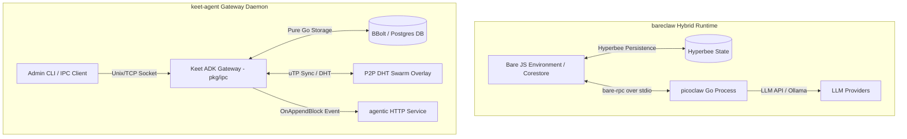

# Architecture & Comparative Analysis: Bare Go Stack (`bareclaw` & `bare-rpc-golang`) vs. Keet ADK Gateway (`keet-agent`)

## 1. Executive Summary

This document provides a comprehensive architectural analysis and comparative evaluation of Holepunch's Go ecosystem components—specifically **`holepunchto/bare-rpc-golang`** and **`holepunchto/bareclaw`**—against the **`keet-agent`** (Keet ADK Gateway) codebase.

* **`bare-rpc-golang`**: A lightweight, wire-compatible Go implementation of the `bare-rpc` binary protocol. It provides structured request/response, one-way events, and streaming with flow control over any standard `io.ReadWriter` stream (stdio, Unix sockets, TCP).
* **`bareclaw`**: A hybrid runtime architecture embedding the `picoclaw` Go AI agent inside the [Bare](https://github.com/holepunchto/bare) JavaScript runtime. It uses `bare-rpc` over `stdio` for cross-language control and delegates state persistence to a JS-side `Hyperbee` index.
* **`keet-agent`**: A standalone, pure-Go daemon acting as an Application Development Kit (ADK) Gateway. It bridges mobile apps and external applications into distributed DHT/uTP P2P swarms, maintaining embedded binary storage (`BBolt`) or relational persistence (`PostgreSQL`), and proxying agent events via HTTP.

---

## 2. Subsystem Architectural Breakdowns



### A. `bare-rpc-golang`
* **Transport Abstraction:** Operates directly over any `io.ReadWriter` interface (e.g., standard input/output streams, Unix sockets, or TCP connections).
* **Binary Serialization:** Powered by `compact-encoding-golang`, encoding schema structures, headers, request IDs, and command opcodes with minimal byte overhead.
* **RPC Capabilities:**
  - **Unary Requests:** Synchronous request/reply pairs mapped to numeric command IDs.
  - **One-Way Events:** Unidirectional notification frames (request ID 0).
  - **Duplex Streaming:** Multiplexes up to two concurrent byte streams per request (`OutgoingStream` / `IncomingStream`) featuring explicit `PAUSE` and `RESUME` flow-control signaling.

### B. `bareclaw`
* **Polyglot Design:** Embeds Go AI capabilities inside Bare JavaScript without exposing terminal noise or shell subprocess complexities to the end user.
* **Process Topology:** Spawns a compiled Go binary (`picoclaw`) as a child process and communicates exclusively via `bare-rpc` over standard I/O streams (`stdio`).
* **State Decoupling:** The Go agent binary acts as a stateless execution engine. Conversation history, session indices, and scope metadata are offloaded to `Hyperbee` (a P2P B-tree built on `Hypercore`/`Corestore`) managed in JavaScript.
* **Bi-Directional RPC Callbacks:** JavaScript code can register custom tool handlers (`registerTool`) with JSON Schemas. When the Go agent decides to execute a tool, it issues an RPC request back to the JavaScript parent process.

### C. `keet-agent` (Keet ADK Gateway)
* **Service Topology:** A pure-Go multi-threaded gateway server documented in `docs/ARCHITECTURE.md`.
* **Interface & Security Layer:** Listens on Unix Domain Sockets or TCP network interfaces (`pkg/ipc`). Enforces public-key whitelisting (`client_whitelist`) before permitting command processing.
* **P2P Engine:** Integrates a Distributed Hash Table (`pkg/dht`) and uTP holepunch replication engine (`pkg/hypercore`, `pkg/network`) for peer discovery and raw block replication.
* **Storage Layer:** Implements an abstract repository pattern with an embedded `BBolt` engine (`storage/gateway.db`) for block binary caching and `PostgreSQL` for production scale (see `docs/embedded-db.md`).
* **Agent Integration:** Triggers non-blocking HTTP POST callbacks (`OnAppendBlock`) to local HTTP services (e.g., `agentic` API on `192.168.1.10`) upon receiving new Hypercore blocks.

---

## 3. Comparative Matrix

| Feature / Dimension | `bare-rpc-golang` | `bareclaw` | `keet-agent` (Current Workspace) |
|---|---|---|---|
| **Primary Scope** | Protocol Library | Hybrid AI Agent Module | Standalone P2P Gateway Daemon |
| **Language & Engine** | Pure Go (`go 1.21+`) | Go binary + Bare JS Runtime | Pure Go (`go 1.21+`) |
| **IPC Infrastructure** | `io.ReadWriter` wrapper | `stdio` via `bare-rpc-golang` | Custom `pkg/ipc` over Unix Socket / TCP |
| **Serialization Format** | `compact-encoding` (Binary) | `compact-encoding` + JSON Schemas | Binary length-prefixed & JSON payloads |
| **State Persistence** | None (In-memory protocol state) | `Hyperbee` (JavaScript side) | Embedded `BBolt` / `PostgreSQL` (Go side) |
| **P2P Capabilities** | Optional transport support | Replicates state via `Corestore` | Native `pkg/dht` & uTP block replication |
| **Agent Execution Engine** | N/A | `picoclaw` (Multi-LLM engine in Go) | HTTP Bridge to `agentic` LLM service |
| **Extensibility Pattern** | Protocol message handlers | RPC Tool Registration (`registerTool`) | Configuration hooks & HTTP REST API |

---

## 4. In-Depth Technical Analysis

### A. IPC & Serialization Protocol Comparison

* **`bare-rpc-golang` / `bareclaw` Protocol Stack:**
  Uses Holepunch's `compact-encoding` format, which serializes integers, strings, arrays, and structs into compact binary representation without heavy JSON parsing overhead. `bare-rpc` frames include request IDs, command tags, flag masks, and payloads. It natively supports framing streaming binary buffers with backpressure control.

* **`keet-agent` Protocol Stack:**
  `keet-agent`'s `pkg/ipc` implements a multi-protocol socket listener (`SocketListener`). While optimized for standard Unix sockets and network TCP, its wire payload handling relies on binary header frames for block storage combined with JSON formatting for high-level management commands.

### B. State Ownership & Architecture Strategy

```
bareclaw Architecture:
┌──────────────────────────┐    bare-rpc over stdio     ┌──────────────────────────┐
│    Bare JS Runtime       │ ─────────────────────────> │   picoclaw Go Engine     │
│  - Hyperbee State        │ <───────────────────────── │   - Stateless Agent Loop │
│  - Corestore Persistence │    tool call RPC response  │   - LLM Provider Interface│
└──────────────────────────┘                            └──────────────────────────┘

keet-agent Architecture:
┌──────────────────────────┐     uTP P2P / IPC Socket   ┌──────────────────────────┐
│   Keet Mobile / Client   │ ─────────────────────────> │    Keet ADK Gateway      │
│  - Peer App Node         │ <───────────────────────── │   - State: BBolt / PG    │
│  - Swarm Subscriber      │      Sync Feed Blocks      │   - DHT & Storage Engine │
└──────────────────────────┘                            └──────────────────────────┘
                                                                     │
                                                           HTTP POST │ (OnAppendBlock)
                                                                     ▼
                                                        ┌──────────────────────────┐
                                                        │  agentic HTTP Service    │
                                                        └──────────────────────────┘
```

* **Stateless Go vs. Stateful Go:**
  - In `bareclaw`, state management is offloaded to JavaScript via `Hyperbee`. The Go process remains stateless between RPC calls; sessions are passed into Go or loaded on demand and exported back to the JS-managed B-tree after execution.
  - In `keet-agent`, the Go binary is fully stateful. It owns the database engine (`pkg/db`), manages BBolt memory-mapped files in `storage/gateway.db`, tracks active peer swarm subscriptions, and buffers binary blocks directly on disk.

### C. Extension & Agent Callback Mechanics

* **`bareclaw` Tool Callbacks:**
  Extensibility is interactive and bi-directional. When `picoclaw` encounters a requirement for an external tool (e.g. system inspection or database query), it sends an RPC request back over `stdio` to the parent JS process. The JS handler runs asynchronously and replies back to Go.

* **`keet-agent` HTTP Proxying:**
  Extensibility is event-driven and decoupled via HTTP. As detailed in `docs/ARCHITECTURE.md`, when a new block is appended to the local Hypercore storage via uTP replication, `OnAppendBlock` launches a non-blocking goroutine that posts a JSON request to an external agent HTTP service (such as `agentic`).

---

## 5. Bare JavaScript Client Compatibility & Integration Guide

### A. Is `keet-agent` Compatible with Bare JS Clients?

**Yes.** `keet-agent` is fully compatible with Bare JavaScript clients (as well as Node.js and browser JS runtimes operating via WebSocket/TCP bridges).

* **Socket Transport (Fully Compatible):** `keet-agent` binds to Unix Domain Sockets (`/tmp/keet-adk.sock`) and TCP Sockets (`tcp://0.0.0.0:12345`). Any Bare JS application can open socket streams using standard `bare-net` or Node `net.connect()`.
* **Wire Protocol (JSON Socket IPC):** Rather than requiring the binary `bare-rpc` / `compact-encoding` wire format, `keet-agent`'s `pkg/ipc` layer communicates via line-delimited JSON command frames parsed by Go's `json.NewDecoder`.

### B. Implemented IPC Commands (`pkg/ipc`)

| Command | Status | Behavior & Payload Details |
|---|---|---|
| `auth` | ✅ Fully Implemented | Authenticates client public keys against `client_whitelist`. |
| `join_swarm` | ✅ Fully Implemented | Hashes topic string into a 32-byte key, registers topic in `BBolt` database, announces on DHT, and resolves peers. |
| `leave_swarm` | ✅ Fully Implemented | Unregisters swarm topic from DHT overlay and DB registry. |
| `append_block` | ✅ Fully Implemented | Decodes base64 string, appends block to Hypercore storage, caches signature in DB, and broadcasts push notifications (`chat_message_received`) to all active IPC clients. |
| `get_block` | ✅ Fully Implemented | Retrieves base64-encoded binary block by index from Hypercore storage (with database cache fallback). |
| `chat_message_received` | ✅ Fully Implemented | Asynchronous push notification automatically broadcast to connected clients upon receiving or replicating new chat blocks. |

### C. Bare JS / Node.js Integration Code Example

```javascript
const net = require('bare-net') // Works in Bare JS runtime & Node.js (`require('net')`)

// 1. Establish connection to keet-agent socket
const client = net.connect('/tmp/keet-adk.sock')

// 2. Process incoming JSON response frames and push notifications
client.on('data', (chunk) => {
  const lines = chunk.toString().trim().split('\n')
  for (const raw of lines) {
    const msg = JSON.parse(raw)
    console.log('Received from keet-agent:', msg)
  }
})

// 3. Join a DHT Swarm Topic
client.write(JSON.stringify({
  command: 'join_swarm',
  topic: 'dev-team-room',
  peer_key: '0123456789abcdef0123456789abcdef0123456789abcdef0123456789abcdef'
}) + '\n')

// 4. Append a Chat Message Block
const chatPayload = Buffer.from(JSON.stringify({
  sender: 'alice_pubkey',
  timestamp: Date.now(),
  content: 'Hello from Bare JS client!'
})).toString('base64')

client.write(JSON.stringify({
  command: 'append_block',
  data: chatPayload,
  feed_key: 'general'
}) + '\n')
```

---

## 6. Architectural Opportunities & Recommendations for `keet-agent`

1. **Adopting `bare-rpc-golang` for Gateway IPC:**
   The gateway currently relies on custom socket framing in `pkg/ipc`. Integrating `bare-rpc-golang` as an IPC transport option would allow standard Holepunch RPC clients (in Node.js, Bare, or Go) to interact with `keet-agent` natively using `compact-encoding`.

2. **Standardizing Serialization across Subsystems:**
   Replacing custom binary packaging in `pkg/db` with `compact-encoding-golang` would ensure serialization parity across Holepunch projects and optimize binary block encoding throughput.

3. **Hybrid Agent Host Integration:**
   `keet-agent` can adopt the `bareclaw` pattern to run embedded AI workflows locally. Instead of forwarding block appends exclusively to an HTTP endpoint (`agentic`), the gateway could host an in-process or RPC-linked Go agent engine like `picoclaw` driven directly by incoming swarm events.

---

## 7. Related Documentation Links

* [System Architecture Guide](docs/ARCHITECTURE.md) — Core topology and thread-safety model.
* [Database Design & Interfaces](docs/embedded-db.md) — Storage engine details and BoltDB serialization.
* [Production Raspberry Pi 5 Guide](docs/production_setup_guide.md) — Local agent integration and Wi-Fi routing setup.
